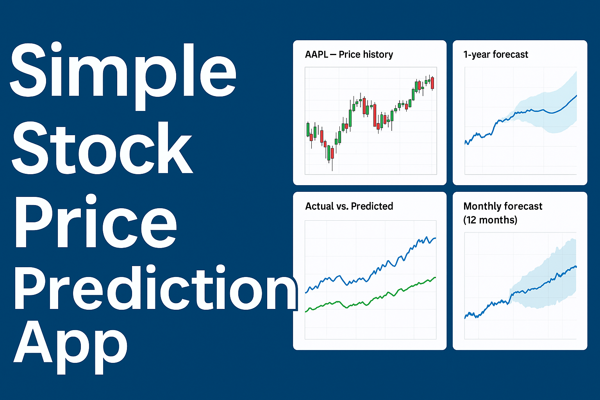

# 📈 Stock Price Prediction Web App (with Prophet)


[](https://www.python.org/)
[](https://streamlit.io/)
[](#)

<p align="center">
  
</p>
---

## 🔍 Overview

This project is an end-to-end **web-based stock forecasting tool** built with **Python, Facebook Prophet**, and **Streamlit**. Users can upload stock price data (CSV format from Yahoo Finance), visualize historical prices, and generate future predictions (up to 1 year) with interactive charts.

Designed for **students, data science beginners, and financial enthusiasts**, this app demonstrates how time series forecasting works using real-world stock data. It also helps users compare predicted prices with actual prices on selected dates — all through a clean and interactive interface.

---

## 🎬 Project Demo

<div align="center">
  <a href="https://youtu.be/kZP5kroO56Q?si=IAgaUtPpsjqIgkni" target="_blank">
    
  </a>
  <br>
  <strong><a href="https://www.youtube.com/watch?v=DF53aO3G2jQ&ab_channel=uvaissaifi" target="_blank">▶️ Watch: Build a Content-Based Anime Recommender System</a></strong>
  <p>Video by Data Science Solutions</p>
</div>

> ⚠️ GitHub does not support embedding actual YouTube videos. Clicking the image will open the video in a new tab.


---

## 🎯 Use Case & Purpose

This project is ideal for:

- 📊 **Understanding Time Series Forecasting** in a visual and practical way
- 🎓 **Learning how to deploy ML models** using Streamlit
- 💹 **Exploring stock trends** and simulating future predictions
- 🧪 **Educational demos** in data science and machine learning

> ⚠️ This project is for **educational use only** and should **not** be used for real trading or financial decision-making.

---

## 🚀 Live Demo

👉 Try the app here: [Streamlit Live App](https://share.streamlit.io/uvais5/stock_price_prediction_app/main/app.py)

---

## 🛠 Tech Stack

| Technology    | Role                               |
|---------------|------------------------------------|
| Python        | Programming language               |
| Prophet       | Time series forecasting model      |
| Streamlit     | Frontend for web-based ML app      |
| Plotly        | Interactive plotting library       |
| Pandas        | Data manipulation                  |
| Pillow        | Image display                      |

---

## 💡 Features

- Upload historical stock CSV data from Yahoo Finance
- Cleanly visualize historical trends with candlestick charts
- Generate **365-day future forecasts**
- View **monthly**, **weekly**, and **yearly** prediction components
- Compare predicted prices with actual prices on a specific date
- Step-by-step guide for users unfamiliar with stock data sources

---

## 🧠 Forecasting Model

This app uses the [Facebook Prophet](https://facebook.github.io/prophet/) forecasting model. Prophet is robust, easy to use, and handles:

- Seasonality (weekly/monthly)
- Trend changes
- Missing data
- Outliers

Prophet is well-suited for business forecasting, making it a great educational tool.

---

## 🔧 Installation

```bash
# Clone the repository
git clone https://github.com/Uvais5/Stock_Price_Prediction_app.git
cd Stock_Price_Prediction_app

# Create virtual environment (optional but recommended)
python -m venv venv
source venv/bin/activate      # On Windows: venv\Scripts\activate

# Install dependencies
pip install -r requirements.txt
